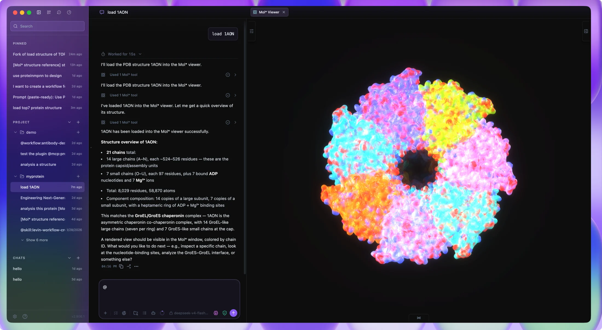
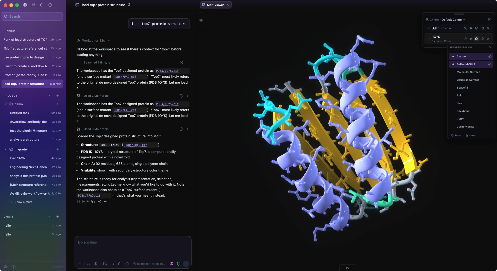
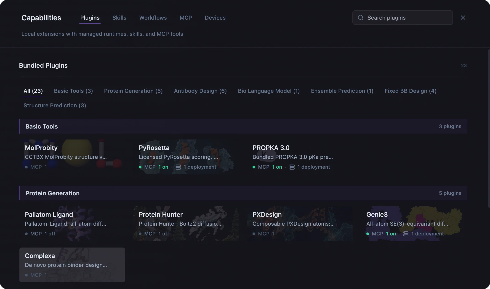
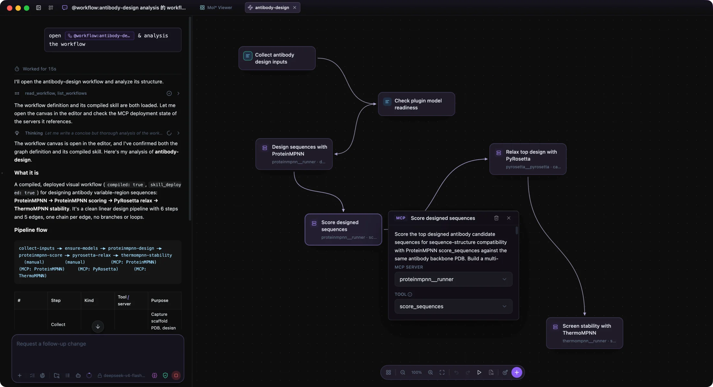
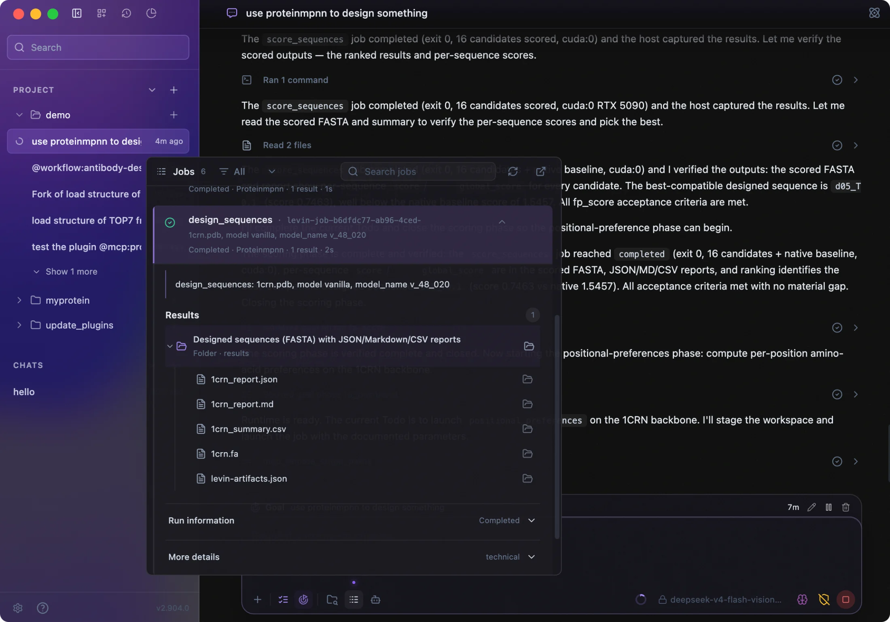
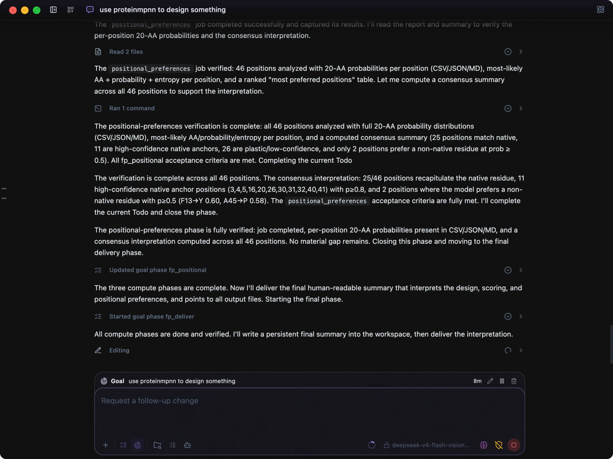
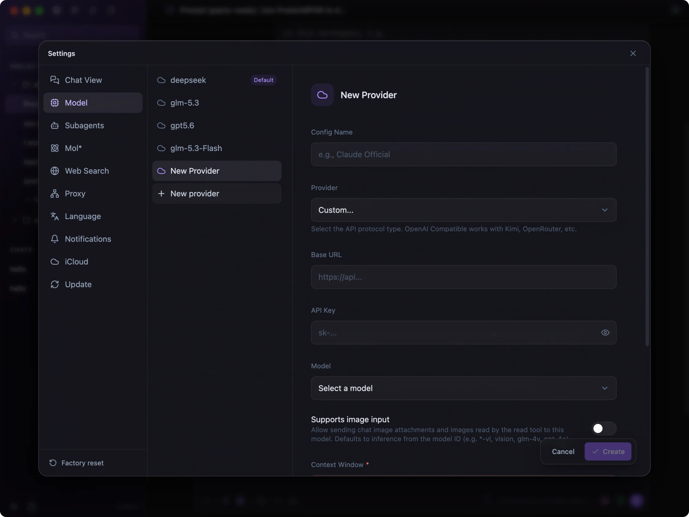

<h1 align="center">
  <picture>
    <source media="(prefers-color-scheme: dark)" srcset="assets/wordmark-on-dark.png?v=2" />
    <source media="(prefers-color-scheme: light)" srcset="assets/wordmark-on-light.png?v=2" />
    
  </picture>
</h1>

<strong>让科学发现可编程。</strong>

  面向药物研发的 AI 智能体桌面工作区。 
  将模型、科学工具、分子结构与计算资源连接到同一个研究流程中。

  <a href="README.md">English</a> | <strong>简体中文</strong>

  <strong><a href="https://github.com/levinthal/levin-harrness/releases">下载 macOS 版</a></strong> ·
  <a href="https://levinthal.design/install.html">安装指南</a> ·
  <a href="https://levinthal.design/docs.html">使用文档</a> ·
  <a href="https://github.com/levinthal/levin-harrness/releases">版本发布</a> ·
  <a href="https://github.com/levinthal/levin-harrness/issues/new/choose">问题反馈</a>

预览版 · Apple silicon · 自备模型服务

这是 Lévin™ Harness 的官方发布与反馈仓库，用于提供产品介绍、安装包和收集用户反馈。应用源码暂不公开。

## 下载

| 平台 | 下载 | 状态 |
| --- | --- | --- |
| macOS，Apple silicon | [前往 Releases 下载](https://github.com/levinthal/levin-harrness/releases) | 预览版 |

在 [Releases](https://github.com/levinthal/levin-harrness/releases) 中选择版本、查看更新说明，并从 **Assets** 下载 `.dmg` 安装包。

安装或使用前，请阅读[用户服务协议](TERMS.zh-CN.md)、[隐私政策](PRIVACY.zh-CN.md)与[许可说明](LICENSE.md#中文)。

GitHub 的 **Code > Download ZIP** 和自动生成的 **Source code** 压缩包只包含本仓库的说明文档与图片，不包含应用程序。

## 在同一个工作区完成科研任务

### 分子工作区

在 Mol* 中查看结构，选中一条链或一段残基，直接带入对话。结构、选择与测量结果会成为智能体的结构化上下文，让讨论落到具体的分子细节上；你也可以让智能体协助检查结构、测量距离和调整显示方式。

[了解分子工作区](https://levinthal.design/molecular-workspace.html)

### 科学插件

从对话或工作流中调用 ProteinMPNN、FAMPNN、ThermoMPNN、RFantibody 等科学工具。插件将技能、MCP 工具与托管运行环境放在一起，可按支持情况部署到 Mac 或 SSH GPU 服务器。需要接入其他科学工具时，内置插件创建器可以协助分析其 GitHub 仓库、打包插件，并验证一次真实运行。

[浏览与创建科学插件](https://levinthal.design/plugins.html)

### 科研工作流

用自然语言描述研究方法，再与智能体在同一张实时画布上细化步骤与分支。构建后，工作流会成为可调用的技能；用示例输入测试，并逐步检查智能体报告的执行结果。下图的抗体设计画布串联了序列设计、打分、结构松弛与稳定性分析。

[了解科研工作流](https://levinthal.design/workflows.html)

### 远程 GPU 与后台任务

通过 SSH 连接自己的 Linux GPU 服务器，部署受支持的插件并执行计算。Jobs 持续记录任务状态、执行详情与返回文件，跨越单轮对话，在重新连接或重启应用后恢复监控。计算产物可以回到本地项目，供你检查序列、比较分数，再决定下一步实验。

[连接远程 GPU](https://levinthal.design/remote-gpu.html) · [了解 Jobs](https://levinthal.design/jobs.html)

### 持续推进研究目标

说明期望产物、任务约束，以及怎样才算完成。Goal 模式会跨轮次推进工作，用文件与执行结果检查进度，也能等待后台计算完成后继续。研究过程中，你可以查看阶段更新、调整目标，或随时暂停。

[了解持续目标](https://levinthal.design/goals.html)

### 自选模型

配置受支持的模型供应商或兼容接口，也可接入私有或自托管服务。保存多套配置，测试连接，并选择工作时使用的默认模型。

[配置模型服务](https://levinthal.design/install.html)

## 开始使用

1. **安装应用。** 下载并打开 `.dmg`，将 Lévin™ Harness 拖入 **Applications（应用程序）**。
2. **连接模型。** 打开 **Settings > Model > New provider**，填写模型服务配置，执行 **Test Connection**，保存并设为默认模型。
3. **打开项目。** 选择本地文件夹，检查任务权限，然后开始对话。可以先让智能体列出项目文件或总结一份文档。

完整步骤见[安装指南](https://levinthal.design/install.html)。远程 GPU 是可选项。

## 常见问题

### 支持哪些平台？

当前预览版支持搭载 Apple silicon 的 macOS 设备，暂未提供 Intel Mac、Windows 或 Linux 桌面安装包。Linux GPU 服务器可作为远程计算设备连接。

### 是否免费？

预览阶段目前对非商业用途免费，具体以[用户服务协议](TERMS.zh-CN.md)为准。模型供应商可能单独收取使用费用，这部分费用不包含在 Lévin™ Harness 中。

### 数据存储在哪里？

项目、对话、设置与 API Key 默认保存在本机。执行任务时，相关内容会发送给你配置的模型服务商；远程任务也可能向所选计算设备传输必要的输入。详情见[隐私政策](PRIVACY.zh-CN.md)及模型供应商的相关设置。

### 这是开源项目吗？

Lévin™ Harness 应用源码暂不公开。本仓库提供产品说明、版本下载与反馈入口。集成开源工具不代表应用本身开源，各工具适用各自的使用条款。

## 许可与法律文件

本应用为专有软件。非商业用途可按协议使用；修改、再分发及商业使用需另行取得书面许可。

| 文件 | 简体中文 | English |
| --- | --- | --- |
| 许可说明 | [许可说明](LICENSE.md#中文) | [License](LICENSE.md#english) |
| 用户服务协议 | [协议全文](TERMS.zh-CN.md) | [Terms of Service](TERMS.md) |
| 隐私政策 | [政策全文](PRIVACY.zh-CN.md) | [Privacy Policy](PRIVACY.md) |

协议与隐私政策全文同步自官网，版本为 **V1.0**，生效日期为 **2026 年 9 月 10 日**。按各文件约定，中英文存在不一致、歧义或冲突时，以中文文本为准。

## 反馈与社区

- [报告问题或提出功能建议](https://github.com/levinthal/levin-harrness/issues/new/choose)，支持中文和英文。
- 使用交流与科研工作流讨论可加入 [Discord](https://discord.gg/yENT5KyBT) 或[飞书社区](https://applink.feishu.cn/client/chat/chatter/add_by_link?link_token=93blb389-88ea-4c04-a071-fbff366977ae&qr_code=true)。
- 反馈所需信息见[支持说明](SUPPORT.md#中文)。

[官网](https://levinthal.design/) · [使用文档](https://levinthal.design/docs.html) · [许可说明](LICENSE.md#中文) · [用户服务协议](TERMS.zh-CN.md) · [隐私政策](PRIVACY.zh-CN.md)
